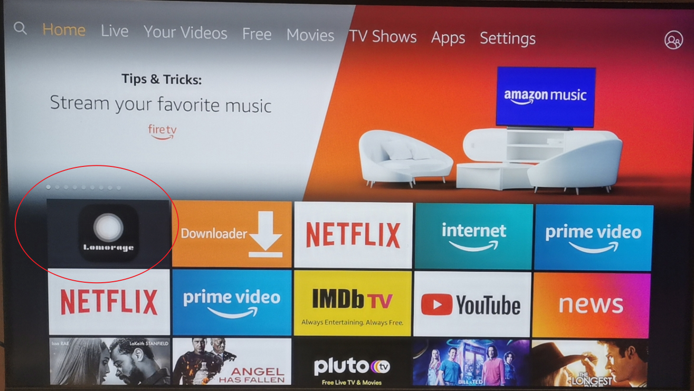
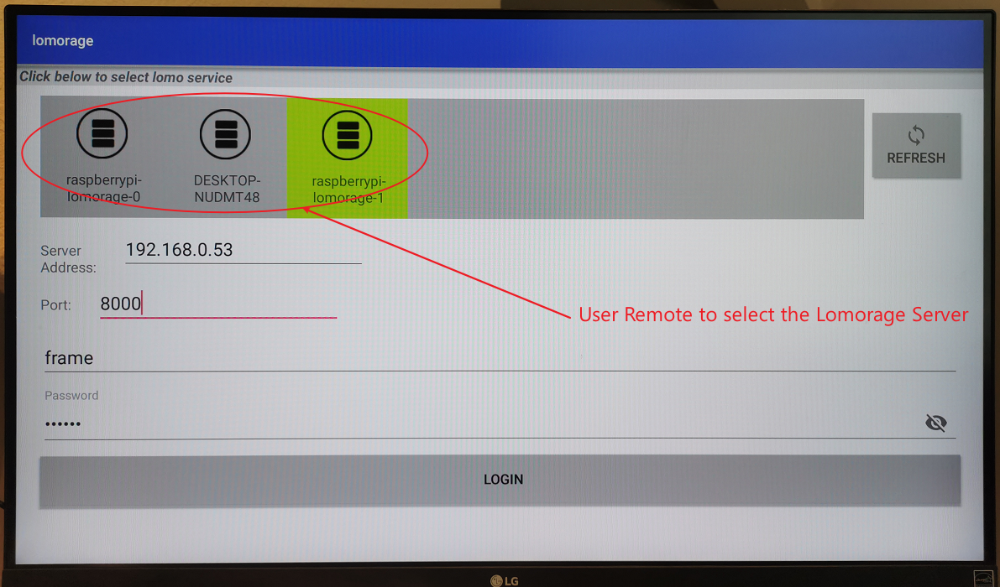
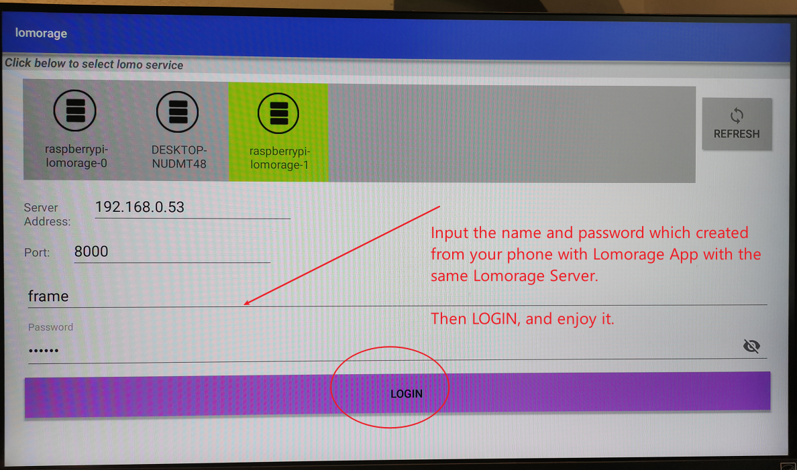
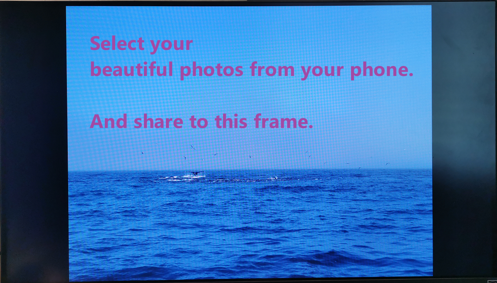

# lomo-android-frame-apk-release
Lomorage frame app for FireTV, android Tablet.

Just install Lomorage App and it will turn your Tablet and TV to smart photo frame. And you can easily to share your phone's photo to this **Lomorage Frame**.

# Youtube video link below
[Turn Your Fire Tablet as Picture Frame with Lomorage](https://www.youtube.com/watch?v=9yXyDkXOGXE)

# Screen shot on FireTV

# Share from phone:

## For Developer
### on windows:
> choco install hub

Then on Windows Terminal or git-bash:
> ./deploy.sh